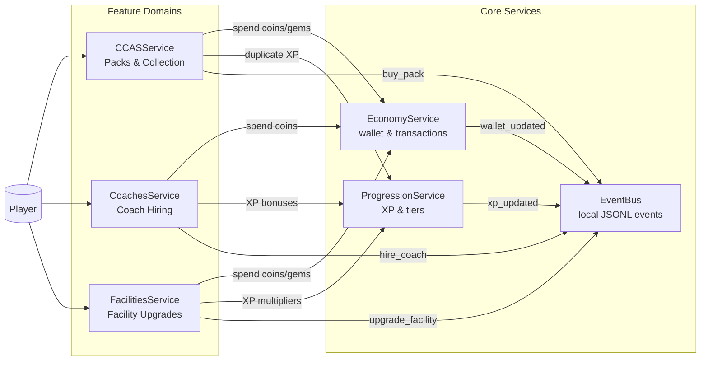
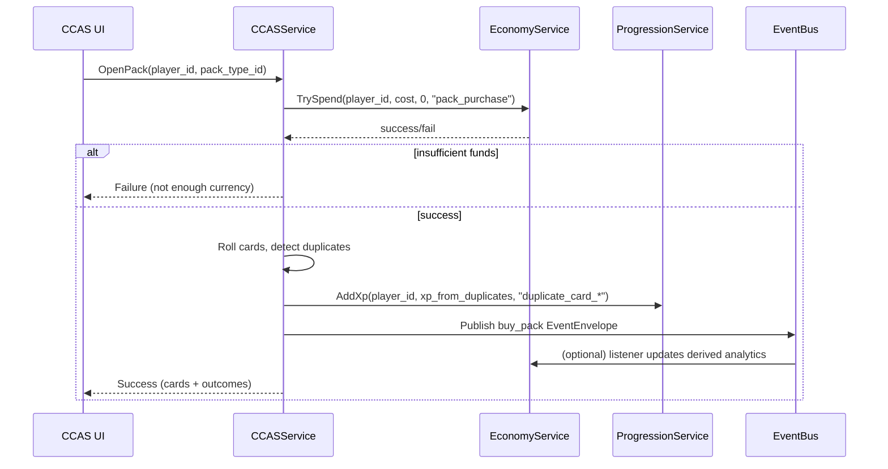

## MGI System Architecture – Living Overview

This document is the **living, high‑level overview** of the offline MGI Deep Management architecture.  
It complements `SYSTEM_DATA_ARCHITECTURE.md` (deep data model) and is kept up to date as implementation work from `INTEGRATION_IMPLEMENTATION_PLAN.md` lands.  
The current implementation targets a **single‑player** game and typically uses a fixed `player_id` such as `"local_player"` when resolving storage paths and events.

---

## 1. High‑Level System Diagram



**Key points**

- **EconomyService** and **ProgressionService** are the central shared services.
- Feature domains (**CCAS**, **Coaches**, **Facilities**) depend on Economy/Progression but not on each other.
- **EventBus** connects everything in a decoupled, offline way and persists events as JSONL for replay/debugging.

---

## 2. Storage Layout & FilePathResolver

Runtime state is stored under:

```text
Application.persistentDataPath/mgi_state/
  {player_id}/
    economy/
    progression/
    ccas/
    facilities/
    coaches/
  events/
    events.log.jsonl
    processed_events.json
```

This layout is enforced by `FilePathResolver` (implemented in `Assets/Scripts/Shared/Storage/FilePathResolver.cs`).  
In the current single‑player prototype, all services will typically pass a constant `playerId` (for example `"local_player"`), so only one profile folder is used, but the structure supports future multi‑profile saves if needed.

### 2.1 FilePathResolver Responsibilities

- **Single source of truth** for all per‑player file paths.
- Ensures directories exist before writing files.
- Provides:
  - `GetPlayerDataRoot(playerId)`
  - `GetEconomyPath(playerId, fileName)`
  - `GetProgressionPath(playerId, fileName)`
  - `GetCCASPath(playerId, fileName)`
  - `GetFacilitiesPath(playerId, fileName)`
  - `GetCoachesPath(playerId, fileName)`
  - `GetEventsLogPath()`
  - `GetProcessedEventsPath()`

All new services (**EconomyService**, **ProgressionService**, etc.) must use `FilePathResolver` to locate their JSON files, guaranteeing consistent structure across the game.

---

## 3. EventBus & Event Flow

### 3.1 EventEnvelope Shape

Events are published through the static `EventBus` (`Assets/Scripts/Shared/Events/EventBus.cs`) as an `EventEnvelope`:

```csharp
public class EventEnvelope
{
    public string event_id;      // GUID, auto-filled if empty
    public string event_type;    // e.g. "buy_pack", "hire_coach"
    public string player_id;     // canonical player id
    public string timestamp;     // ISO-8601 UTC, auto-filled if empty
    public string payloadJson;   // opaque JSON string with event-specific data
}
```

- **Producers** create a strongly‑typed payload object, serialize it to JSON, and put it in `payloadJson`.
- **Consumers** deserialize `payloadJson` into the appropriate type for that `event_type`.

### 3.2 EventBus Behavior

- `EventBus.Publish(EventEnvelope evt)`
  - Fills `event_id` and `timestamp` if missing.
  - Notifies all in‑process subscribers for `evt.event_type`.
  - Appends the event as a **single line of JSON** to `events.log.jsonl` using `FilePathResolver.GetEventsLogPath()`.
- `EventBus.Subscribe(string eventType, Action<EventEnvelope> handler)`
  - Registers a callback for that `event_type`.
  - Returns an `IDisposable` that unsubscribes when disposed.

This gives:

- Cheap, append‑only event logging for offline debugging and replay.
- A simple **pub/sub** mechanism to connect services without tight coupling.

### 3.3 Event Flow Example (Pack Purchase)



---

## 4. How This Ties into the Implementation Plan

### 4.1 Status of Global Prerequisites (0.1 & 0.2)

From `INTEGRATION_IMPLEMENTATION_PLAN.md`:

- **0.1 Shared Runtime Paths (`FilePathResolver`)**
  - ✅ **Implemented** as `Assets/Scripts/Shared/Storage/FilePathResolver.cs`.
  - Future work that depends on it:
    - All services (`EconomyService`, `ProgressionService`, `CCASService`, `FacilitiesService`, `CoachesService`) will use it to read/write their JSON files.
    - Any new subsystem must also use `FilePathResolver` to remain consistent.

- **0.2 Minimal Shared EventBus**
  - ✅ **Implemented** as `Assets/Scripts/Shared/Events/EventBus.cs`.
  - Future work that depends on it:
    - All cross‑team events described in `SYSTEM_DATA_ARCHITECTURE.md` (`buy_pack`, `hire_coach`, `upgrade_facility`, `xp_updated`, `wallet_updated`, etc.) will be represented as `EventEnvelope` messages.
    - Services can rely on a stable `Publish`/`Subscribe` API and the presence of `events.log.jsonl` for diagnostics.

### 4.2 Impact on Future Changes

- **Service Implementations Simplified**
  - When implementing `EconomyService` later, engineers don’t need to decide where to store `wallet.json`; they call:
    - `FilePathResolver.GetEconomyPath(playerId, "wallet.json")`.
  - Similarly, event producers don’t need to know how logging is done; they call:
    - `EventBus.Publish(...)`, and logging happens centrally.

- **Refactors Localized**
  - If storage layout changes (e.g. new root folder structure), only `FilePathResolver` must be updated; all services automatically follow.
  - If event logging needs to be enriched or disabled, changes are localized to `EventBus.AppendToLog`.

- **Architecture Docs Stay Accurate**
  - `SYSTEM_DATA_ARCHITECTURE.md` describes:
    - `mgi_state` layout.
    - `events.log.jsonl` and `processed_events.json`.
  - Those descriptions now map directly to **real code** (`FilePathResolver`, `EventBus`), and future edits to the layout should update both the code and this overview file.

---

## 5. Quick Reference – Who Uses What?

```mermaid
flowchart TB
    FPR[FilePathResolver\n(path building)]
    EB[EventBus\n(pub/sub + JSONL)]

    Econ[EconomyService]
    Prog[ProgressionService]
    CCAS[CCASService]
    Facil[FacilitiesService]
    Coach[CoachesService]

    FPR --> Econ
    FPR --> Prog
    FPR --> CCAS
    FPR --> Facil
    FPR --> Coach

    Econ --> EB
    Prog --> EB
    CCAS --> EB
    Facil --> EB
    Coach --> EB
```

- **All services** depend on `FilePathResolver` for storage and on `EventBus` for integration.
- This makes `FilePathResolver` and `EventBus` the **first stable building blocks** in the offline architecture, which everything else can safely build on. 

