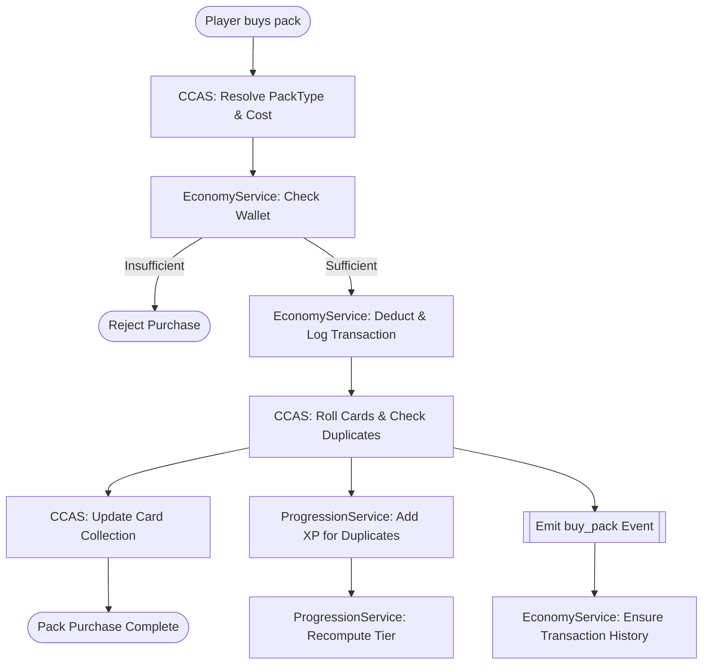

## 1. Overview

This document defines the **offline, file‑backed data architecture** for the MGI Deep Management prototype.  
All systems run **entirely offline**, with **no REST APIs or cloud services** at runtime. Integration happens via:

- **Unity scripts** (MonoBehaviours & service classes)
- **Local JSON files** in `Assets/StreamingAssets` (authoring, baselines) and a runtime writeable area (e.g. `Application.persistentDataPath`)
- **Shared service contracts** between subsystems (Economy, Progression, CCAS, Coaches, Facilities)

The goal is to:

- Normalize **entities, primary keys, and relationships**
- Define **ownership** per subsystem
- Map **event flows** (pack purchase, duplicate conversion, coach hire, facility upgrade)
- Propose a **local storage layout** and **Unity integration pattern**
- Provide **cross‑team contracts** so each subsystem can evolve safely and independently

While the architecture supports multiple player profiles (via `player_id`), the current game build is **single‑player**. In practice, services can pass a fixed id such as `"local_player"` when resolving file paths or publishing events, and expand to multiple profiles later if required.

---

## 2. Subsystem Responsibilities & Ownership

- **Economy**
  - **Owns**: Wallet balances, wallet transactions, economic health/analytics.
  - **Reads**: Player, Progression (for projections), CCAS events, Coaches/Facilities spending events.
  - **Writes**: `wallet.json`, `wallet_transactions.json`, `economy_health.json`.

- **Progression**
  - **Owns**: Player XP, tiers, XP rules and history.
  - **Reads**: Player, Facilities multipliers, CCAS duplicate XP rewards, Coaching bonuses.
  - **Writes**: `progression_state.json`, `xp_history.json`.

- **CCAS (Acquisition / Packs & Cards)**
  - **Owns**: Card definitions, pack definitions, duplicate conversion rules, local card collection.
  - **Reads**: Economy wallet (for affordability), Progression (optional for emotional tuning), Player.
  - **Writes**: `card_collection.json`, `pack_drop_history.json`, **events** such as `buy_pack`, `xp_from_duplicate`.

- **Coaches**
  - **Owns**: Coach catalog, coach contracts, team–coach assignment.
  - **Reads**: Economy wallet (hire cost), Progression (XP modifiers), Facilities (synergy).
  - **Writes**: `coaches_catalog.json`, `coach_contracts.json`, `teams.json`, **events** such as `hire_coach`.

- **Facilities**
  - **Owns**: Facility definitions/config, player facility levels, facility multipliers.
  - **Reads**: Economy wallet (upgrade cost), Player, Progression (to apply multipliers).
  - **Writes**: `facilities_config.json`, `player_facilities.json`, **events** such as `upgrade_facility`.

No subsystem may mutate another’s JSON files directly; all cross‑team actions go through **services + events**.

---

## 3. Entity Definitions & Primary Keys

### 3.1 Core Cross‑Cutting Entities

- **Player**
  - **Fields (canonical)**
    - `player_id: string` (GUID, e.g. `"550e8400-e29b-41d4-a716-446655440000"`)
    - `display_name: string`
    - `created_at: string (ISO 8601)`
  - **Primary key**: `player_id`
  - **Owned by**: Progression (player lifecycle & progression), but referenced by all.
  - **Used in JSON**
    - `player_id` string in `facilities.json` (`player_facilities.player_id`)
    - `player_id` in `Economy/health.json`
    - `player_id` numeric in `Economy/wallet_display_response.json` (needs normalization)
    - `user_id` in `Economy/wallet_transactions.json` (should converge to `player_id`)

- **Wallet**
  - **Fields**
    - `wallet_id: string` (optional; can equal `player_id` for 1‑1)
    - `player_id: string` (FK → Player)
    - `coins: int`
    - `gems: int`
    - `coaching_credits: int`
    - `last_updated: string (ISO 8601)`
  - **Primary key**: `wallet_id` (or simply re‑use `player_id` as id for v1)
  - **Owned by**: Economy
  - **Unity references**
    - `PlayerWallet.cs` (CCAS prototype) currently stores `coins` via `PlayerPrefs` with key `"wallet_coins"`.
    - `WalletInfoPanel.cs` holds `coins`, `gems`, `coachingCredits` as in‑memory fields (no persistence yet).

- **WalletTransaction**
  - **Fields** (from `Economy/wallet_transactions.json`)
    - `id: string` (GUID)
    - `player_id: string` (currently `user_id` → normalize to `player_id`)
    - `amount: int`
    - `currency: "coins" | "gems" | "coaching_credits"`
    - `type: "earn" | "spend"`
    - `timestamp: string (ISO 8601)`
    - `source: string` (e.g. `"coach_hiring"`, `"pack_purchase"`, `"match_win"`, `"upgrade_facility"`)
  - **Primary key**: `id`
  - **Owned by**: Economy
  - **Foreign keys**
    - `player_id` → Player
    - Optional: `source` may map to domain entities (`coach_id`, `pack_id`, etc.) via additional fields.

### 3.2 CCAS (Cards & Packs)

- **Card**
  - Defined in `Assets/StreamingAssets/CCAS/cards_catalog.json` and its C# models (e.g. `Card`).
  - **Fields** (inferred from usage)
    - `card_id: string` (PK)
    - `name: string`
    - `team: string`
    - `element: string`
    - `position: string`
    - `rarity: "common" | "uncommon" | "rare" | "epic" | "legendary"`
    - Additional meta: stats, tags, etc. (as in catalog)
  - **Primary key**: `card_id`
  - **Owned by**: CCAS (card catalog)
  - **Unity references**
    - `Card` class and `CardView.Apply(Card)` in `CardView.cs`.
    - `PackOpeningController` uses `Card` objects and `card.GetRarityString()`.

- **PackType**
  - Defined in `phase1_config.json` and `DropConfigModels.cs` (`PackType` class).
  - **Fields** (from `phase1_config.json` + models)
    - `pack_type_id: string` (dictionary key, e.g. `"bronze_pack"`)
    - `name: string` (e.g. `"Bronze Pack"`)
    - `cost: int` (coins only in current phase)
    - `guaranteed_cards: int`
    - `drop_rates: { common, uncommon, rare, epic, legendary }`
    - `score_range: { min_score: int, max_score: int }`
  - **Primary key**: `pack_type_id`
  - **Owned by**: CCAS
  - **Unity references**
    - `DropConfigManager.config.pack_types[packType]` in `PackOpeningController.OpenPack`.
    - `PlayerWallet.CanAfford(PackType)` uses `p.cost`.

- **DuplicateXPRule**
  - From `phase1_config.json` + `DuplicateXP` class.
  - **Fields**
    - `common_duplicate_xp: int`
    - `uncommon_duplicate_xp: int`
    - `rare_duplicate_xp: int`
    - `epic_duplicate_xp: int`
    - `legendary_duplicate_xp: int`
  - **Primary key**: implicit singleton per CCAS config (no explicit id).
  - **Owned by**: CCAS (but feeds Progression).

- **CardCollectionEntry**
  - **Fields**
    - `player_id: string` (FK → Player)
    - `card_id: string` (FK → Card)
    - `quantity: int`
    - `first_acquired_at: string (ISO 8601)`
  - **Primary key**: composite (`player_id`, `card_id`)
  - **Owned by**: CCAS

- **PackDropHistoryEntry**
  - **Fields**
    - `id: string` (GUID)
    - `player_id: string`
    - `pack_type_id: string`
    - `cost_paid: { coins: int, gems: int }`
    - `cards_pulled: CardPull[]`
      - `card_id: string`
      - `rarity: string`
      - `is_duplicate: bool`
      - `xp_awarded: int` (if duplicate)
    - `timestamp: string (ISO 8601)`
  - **Primary key**: `id`
  - **Owned by**: CCAS

### 3.3 Progression

- **ProgressionConfig**
  - From `Progression/progression.json`.
  - **Fields**
    - `schema_version: string`
    - `xp_reward_rules`: base XP/bonuses per action.
    - `tier_progression: Record<string, TierData>`
      - `TierData`: `min_xp`, `max_xp`, `display_name`, `unlock_features[]`
    - `xp_calculation`, `milestone_tracking` (metadata).
  - **Primary key**: implicit singleton config.
  - **Owned by**: Progression.

- **PlayerProgressionState**
  - Corresponds to what `ApiClient.PlayerProgressionSaveData` exposes in `SeasonManager`.
  - **Fields** (inferred)
    - `player_id: string`
    - `current_xp: int`
    - `current_tier: string` (e.g. `"rookie"`, `"pro"`)
    - `tier_progression: Record<string, TierData>` (copied from config or referenced)
    - `xp_history: XpHistoryEntry[]`
  - **Primary key**: `player_id`
  - **Owned by**: Progression.

- **XpHistoryEntry**
  - From `SeasonManager.XpHistory` formatting.
  - **Fields**
    - `id: string` (GUID)
    - `player_id: string`
    - `timestamp: string (ISO 8601)`
    - `xp_gained: int`
    - `source: string` (e.g. `"match_win"`, `"duplicate_card_common"`)
  - **Primary key**: `id`
  - **Owned by**: Progression.

- **Season / Team**
  - From `SeasonManager` and related models (`SeasonSaveData`, `TeamSaveData`).
  - **TeamSaveData fields (inferred)**:
    - `team_id: string`
    - `player_id: string` (bool `is_player_team` plus `player_id` seen in Facilities)
    - `stats: { points: int, wins: int, ... }`
    - `is_player_team: bool`
  - **Primary key**: `team_id` for Team; `season_id` for Season (if present).
  - **Owned by**: Progression.

### 3.4 Economy

- **EconomyHealth**
  - From `Economy/health.json`.
  - **Fields**
    - `player_id: string`
    - `analysis_timestamp: string`
    - `health_status: string`
    - `economic_metrics: { inflation_rate, resource_scarcity, balance_trend, transaction_velocity, risk_score }`
    - `failure_predictions[]`
    - `mitigation_suggestions[]`
    - `analysis_period_weeks: int`
    - `confidence_score: float`
    - `next_analysis_due: string`
  - **Primary key**: `(player_id, analysis_timestamp)` or synthetic `id`.
  - **Owned by**: Economy.

### 3.5 Facilities

- **FacilityDefinition**
  - From `Facilities/facilities.json` and supporting files.
  - **Fields**
    - `facility_type_id: string` (e.g. `"weight_room"`, `"film_room"`, `"rehab_center"`)
    - `display_name: string`
    - `max_level: int`
    - `levels[]: FacilityLevel`
      - `level: int`
      - `upgrade_cost: int` (coins)
      - `descriptor: string`
      - `benefits[]: string` (key/value encoded, e.g. `"PlayerStrengthBoost: 0.04"`)
      - `validation: { minCost, maxCost, effectCaps{...} }`
  - **Primary key**: `facility_type_id`
  - **Owned by**: Facilities.

- **PlayerFacilityState**
  - Embedded under `"player_facilities"` in `Facilities/facilities.json`.
  - **Fields**
    - `player_id: string`
    - `facilities: Record<facility_type_id, PlayerFacilityProgress>`

- **PlayerFacilityProgress**
  - Per facility type.
  - **Fields**
    - `facility_type_id: string`
    - `level: int`
    - `max_level: int`
    - `levels: FacilityLevel[]` (copied from config; can be normalized out)
  - **Primary key**: composite (`player_id`, `facility_type_id`)
  - **Owned by**: Facilities.

### 3.6 Coaches

- **Coach**
  - From `Coaches/coaches_schema_data.json` / `coaches_stubs.json`.
  - **Fields**
    - `coach_id: string`
    - `coach_name: string`
    - `coach_type: string`
    - `experience: string`
    - Performance stats & ratings
    - `salary: number`
    - `contract_length: int`
    - `bonus_percentage: number`
    - `current_team`: string (`team_id` or human‑readable name)
  - **Primary key**: `coach_id`
  - **Owned by**: Coaches.

- **Team (Coaches view)**
  - From `coaches_stubs.json` `"team"` entries.
  - **Fields**
    - `team_id: string`
    - `player_id: string` (FK → Player)
    - `team_name: string`
    - `league: string`
    - `offence_coach: string` (FK → Coach)
    - `defence_coach: string` (FK → Coach)
    - `special_teams_coach: string` (FK → Coach; note typo `speacial_teams_coach` needs cleanup)
    - Depth chart fields, budget, ratings.
  - **Primary key**: `team_id`
  - **Owned by**: Coaches (for coaching assignments); overlaps with Progression’s TeamSaveData.

- **Game (Match)**
  - From `coaches_stubs.json` `"game"` entries.
  - **Fields**
    - `match_id: string`
    - `league: string`
    - `home_team: string` (FK → Team)
    - `away_team: string` (FK → Team)
    - `result: string`
    - `home_team_offence_coach`, `home_team_defence_coach`, `home_team_special_teams_coach` (FK → Coach)
    - `away_team_offence_coach`, `away_team_defence_coach`, `away_team_special_teams_coach` (FK → Coach)
  - **Primary key**: `match_id`
  - **Owned by**: Coaches.

---

## 4. Foreign Key Relationships

### 4.1 Player‑centric Relationships

- **Player → Wallet**
  - `Wallet.player_id` (or `wallet_id == player_id`) references `Player.player_id`.
  - **Cardinality**: 1 Player → 1 Wallet.

- **Player → Progression**
  - `PlayerProgressionState.player_id` → `Player.player_id`.
  - **Cardinality**: 1 Player → 1 ProgressionState.

- **Player → CardCollection**
  - `CardCollectionEntry.player_id` → `Player.player_id`.
  - **Cardinality**: 1 Player → N CardCollectionEntry rows.

- **Player → Facilities**
  - `PlayerFacilityState.player_id` → `Player.player_id`.
  - **Cardinality**: 1 Player → N PlayerFacilityProgress.

- **Player → Teams (Coaches + Progression)**
  - `TeamSaveData.player_id` / `coaches.team.player_id` → `Player.player_id`.
  - **Cardinality**: 1 Player → N Teams (sandboxed; may be 1 in prototype).

- **Player → EconomyHealth**
  - `EconomyHealth.player_id` → `Player.player_id`.

- **Player → WalletTransaction**
  - `WalletTransaction.player_id` → `Player.player_id`.

### 4.2 Card & Pack Relationships

- **PackType → Card**
  - `PackType.drop_rates` defines probability distribution across rarities, which index into `Card` catalog.
  - Not a direct FK, but `cards_catalog.json` must cover all card_ids produced by pack logic.

- **CardCollectionEntry → Card**
  - `card_id` → `Card.card_id`.

- **PackDropHistoryEntry → PackType**
  - `pack_type_id` → `PackType.pack_type_id`.

### 4.3 Coaches & Teams

- **Team (Coaches) → Player**
  - `team.player_id` → `Player.player_id`.

- **Team → Coach**
  - `team.offence_coach` → `Coach.coach_id`
  - `team.defence_coach` → `Coach.coach_id`
  - `team.special_teams_coach` → `Coach.coach_id`

- **Game → Team**
  - `game.home_team` → `team.team_id`
  - `game.away_team` → `team.team_id`

- **Game → Coach**
  - `home_team_offence_coach` / `home_team_defence_coach` / `home_team_special_teams_coach` → `Coach.coach_id`
  - Same for away team fields.

### 4.4 Facilities

- **PlayerFacilityProgress → FacilityDefinition**
  - `facility_type_id` (e.g. `"weight_room"`) → `FacilityDefinition.facility_type_id`.

### 4.5 Economy Cross‑Subsystem

- **WalletTransaction.source** as implicit link:
  - `"pack_purchase"` → `PackDropHistoryEntry`
  - `"coach_hiring"` → Coach hire events (`coach_id`, `team_id`)
  - `"upgrade_facility"` → FacilityUpgrade events (`facility_id`, `new_level`)
  - `"match_win"` → Matches (Game), Progression XP events

For production, consider **augmenting events** with explicit IDs for these domain entities (e.g. `coach_id`, `facility_type_id`, `pack_type_id`) in both the event payload and transactions.

---

## 5. Event Flows Between Subsystems

This section aligns the Python Mermaid diagrams (`generate_diagrams.py`) with concrete entities and files.

### 5.1 Pack Opening / Pack Purchase Flow

**Event name**: `buy_pack`  
**Producer**: CCAS  
**Consumers**: Economy, Progression, (optional) Telemetry

**Input**

- `player_id`
- `pack_type_id`

**Steps**

1. **UI**: `AcquisitionHubController.ShowPackOpening(packKey)` calls `PackOpeningController.OpenPackOfType(packKey)`.
2. **CCAS** obtains `PackType` from `DropConfigManager.config.pack_types[packType]`.
3. **EconomyService** (shared service) checks wallet:
   - Reads `wallet.json` for `player_id`.
   - Validates the `coins` / `gems` balance vs `PackType.cost`.
4. If insufficient funds, UI shows rejection.
5. If sufficient:
   - Economy deducts cost:
     - Updates in‑memory wallet model and writes back to `wallet.json`.
     - Appends a `WalletTransaction` (`type: "spend"`, `source: "pack_purchase"`) in `wallet_transactions.json`.
6. **CCAS** uses pack config + card catalog to roll specific `Card` instances:
   - `DropConfigManager.PullCards(packType)` returns `List<Card>`.
   - For each `Card`, CCAS checks player’s `CardCollectionEntry` set to detect duplicates.
7. For each duplicate `Card`:
   - CCAS consults `DuplicateXPRule` for `rarity` → `xp_value`.
   - Emits an **XP event** (`xp_from_duplicate`) with:
     - `player_id`, `xp_gained`, `source = "duplicate_card_<rarity>"`, details about card.
8. **CardCollection** is updated:
   - `CardCollectionEntry.quantity` incremented per `card_id`.
   - Write to `card_collection.json`.
9. **CCAS** emits a **buy_pack event**:
   - Example payload:

```json
{
  "event_id": "uuid",
  "event_type": "buy_pack",
  "player_id": "550e8400-e29b-41d4-a716-446655440000",
  "pack_type_id": "bronze_pack",
  "cost_paid": { "coins": 1000, "gems": 0 },
  "cards_pulled": [
    { "card_id": "card_001", "rarity": "common", "is_duplicate": false, "xp_awarded": 0 },
    { "card_id": "card_002", "rarity": "rare", "is_duplicate": true, "xp_awarded": 25 }
  ],
  "timestamp": "2025-11-12T10:31:33.146574"
}
```

10. **EconomyService** listens to `buy_pack` events and:
    - Ensures transaction logging in `wallet_transactions.json` (if not already done at step 5).
11. **ProgressionService** listens to `xp_from_duplicate` events:
    - Updates `PlayerProgressionState.current_xp`.
    - Appends `XpHistoryEntry` to `xp_history.json`.
    - Recomputes `current_tier` from `ProgressionConfig.tier_progression`.

**JSON files updated**

- `economy/wallet.json`
- `economy/wallet_transactions.json`
- `ccas/card_collection.json`
- `ccas/pack_drop_history.json`
- `progression/progression_state.json`
- `progression/xp_history.json`

**Mermaid summary (aligns with Python DFD)**:



### 5.2 Coach Hiring Flow

**Event name**: `hire_coach`  
**Producer**: Coaches  
**Consumers**: Economy, Progression (indirect XP modifiers)

**Input**

- `player_id`
- `team_id`
- `coach_id`

**Steps**

1. Player selects a coach to hire in Coaching UI.
2. Coaching system reads coach cost from `coaches_catalog.json`.
3. Coaching requests a wallet validation from EconomyService:
   - Reads `wallet.json` and checks coins.
4. If sufficient:
   - EconomyService deducts coins and logs a `WalletTransaction` with `source = "coach_hiring"`.
   - Coaching assigns coach to player’s team:
     - Updates `teams.json` or `coach_contracts.json` to set `current_team` / `offence_coach` etc.
5. Coaching emits `hire_coach` event:

```json
{
  "event_id": "uuid",
  "event_type": "hire_coach",
  "player_id": "550e8400-e29b-41d4-a716-446655440000",
  "team_id": "team_001",
  "coach_id": "coach_123",
  "cost_paid": { "coins": 500, "gems": 0 },
  "timestamp": "2025-11-12T10:31:33.146574"
}
```

6. EconomyService listens and ensures transaction history is consistent.
7. ProgressionService may adjust XP calculations based on coach bonuses (reading `teams.json` and `coaches_catalog.json`) but **does not own those files**.

**JSON files updated**

- `economy/wallet.json`
- `economy/wallet_transactions.json`
- `coaches/teams.json` / `coaches/coach_contracts.json`

### 5.3 Facility Upgrade Flow

**Event name**: `upgrade_facility`  
**Producer**: Facilities  
**Consumers**: Economy, Progression

**Input**

- `player_id`
- `facility_type_id`

**Steps**

1. Player selects facility upgrade in Facilities UI.
2. Facilities reads `facilities_config.json` for current `level` and `upgrade_cost`.
3. Facilities calls EconomyService to validate wallet balance (coins and optionally gems, if introduced).
4. If sufficient:
   - EconomyService deducts and logs a `WalletTransaction` (`source: "upgrade_facility"`).
   - Facilities increments `PlayerFacilityProgress.level` for the `facility_type_id`.
   - Facilities recalculates derived multipliers.
5. Facilities emits `upgrade_facility` event:

```json
{
  "event_id": "uuid",
  "event_type": "upgrade_facility",
  "player_id": "550e8400-e29b-41d4-a716-446655440000",
  "facility_type_id": "weight_room",
  "new_level": 3,
  "cost_paid": { "coins": 30000, "gems": 0 },
  "timestamp": "2025-11-12T10:31:33.146574"
}
```

6. ProgressionService listens to `upgrade_facility` events:
   - Reads `player_facilities.json` to apply updated multipliers when computing XP from matches or training.

**JSON files updated**

- `economy/wallet.json`
- `economy/wallet_transactions.json`
- `facilities/player_facilities.json`

### 5.4 Event Synchronization Pattern

The Python `EVENT_SYNC_FLOW` sequence diagram is realized as a **local event bus** with file‑backed persistence:

- Each subsystem **emits events** to a shared queue file (e.g. `StreamingAssets/events/events.log.jsonl` or in persistent data).
- Shared services (EconomyService, ProgressionService, etc.) **subscribe** in memory and also write processed events to **idempotent logs**.

Key rules:

- All events must include:
  - `event_id`, `event_type`, `player_id`, `timestamp`.
- Consumers must be resilient:
  - Processing events should be **idempotent** (safe to re‑apply by checking `event_id` against a local `processed_events.json`).

---

## 6. Local Storage Design

Because runtime write access to `Assets/StreamingAssets` is limited, use that folder primarily for **schemas/configs** and keep player state under a runtime directory (e.g. `Application.persistentDataPath/mgi_state/`). This layout is already implemented by `FilePathResolver`. For clarity this section uses logical paths; actual implementation maps them via that helper.

### 6.1 Recommended Layout

```text
StreamingAssets/
  Economy/
    wallet_schema.json          # schema only (optional)
    wallet_transactions_schema.json
    economy_forecast.json       # design/prototype
  Progression/
    progression.json            # XP rules & tiers (already present)
  CCAS/
    cards_catalog.json          # card definitions
    phase1_config.json          # pack types, duplicate XP, emotions
  Facilities/
    facilities.json             # facility definitions + design baseline
  Coaches/
    coaches_schema_data.json    # schema & stubs

PersistentDataPath/mgi_state/
  economy/
    wallet.json                 # per-player wallet
    wallet_transactions.json    # append-only ledger
    economy_health.json         # per-player economic analysis
  progression/
    progression_state.json      # PlayerProgressionState
    xp_history.json             # XpHistoryEntry[]
  ccas/
    card_collection.json        # CardCollectionEntry[]
    pack_drop_history.json      # PackDropHistoryEntry[]
  facilities/
    player_facilities.json      # PlayerFacilityState[]
  coaches/
    teams.json                  # team assignments per player
    coach_contracts.json        # active coach contracts
  events/
    events.log.jsonl            # append-only event log (one EventEnvelope per line, including payloadJson)
    processed_events.json       # ids of processed events per subsystem (for idempotency)
```

### 6.2 Script Responsibilities (Read/Write)

- **EconomyService** (new Unity service class)
  - **Reads**
    - `economy/wallet.json`
    - `economy/wallet_transactions.json`
  - **Writes**
    - `economy/wallet.json`
    - `economy/wallet_transactions.json`
    - `economy/economy_health.json` (optional)
  - **Used by**
    - CCAS (afford pack)
    - Coaches (hire coach)
    - Facilities (upgrade facility)
    - Economy UI (`WalletInfoPanel`, `EconomyTopBarUI`, `TransactionLedgerPanel`).

- **ProgressionService**
  - **Reads**
    - `progression/progression.json` (config)
    - `progression/progression_state.json`
    - `facilities/player_facilities.json` (multipliers)
    - `coaches/teams.json` (coach bonuses)
  - **Writes**
    - `progression/progression_state.json`
    - `progression/xp_history.json`
  - **Used by**
    - Match simulation (`SeasonManager` replacing ApiClient online calls).
    - CCAS (duplicate XP events).

- **CCASService**
  - **Reads**
    - `ccas/cards_catalog.json`
    - `ccas/phase1_config.json`
    - `economy/wallet.json` (via EconomyService)
    - `ccas/card_collection.json`
  - **Writes**
    - `ccas/card_collection.json`
    - `ccas/pack_drop_history.json`
    - `events/events.log.jsonl` (buy_pack, xp_from_duplicate)

- **CoachesService**
  - **Reads**
    - `coaches/coaches_catalog.json`
    - `economy/wallet.json` (via EconomyService)
  - **Writes**
    - `coaches/teams.json`
    - `coaches/coach_contracts.json`
    - `events/events.log.jsonl` (hire_coach)

- **FacilitiesService**
  - **Reads**
    - `facilities/facilities.json` (config)
    - `facilities/player_facilities.json`
    - `economy/wallet.json` (via EconomyService)
  - **Writes**
    - `facilities/player_facilities.json`
    - `events/events.log.jsonl` (upgrade_facility)

---

## 7. Unity Integration Architecture

### 7.1 High‑Level Service Layer

Introduce **non‑MonoBehaviour service classes** (or singleton MonoBehaviours) that are the **only code allowed** to touch persistent JSON for their subsystem:

- `EconomyService`
- `ProgressionService`
- `CCASService`
- `CoachesService`
- `FacilitiesService`
- `EventBus` (local)

Example interactions:

- `PackOpeningController`:
  - Calls `CCASService.OpenPack(player_id, pack_type_id)` which internally:
    - Uses `EconomyService.TrySpend(player_id, coins, gems, source="pack_purchase")`.
    - Uses CCAS logic to roll cards and detect duplicates.
    - Calls `ProgressionService.AddXPFromDuplicate(...)` for each duplicate.
    - Emits `buy_pack` event via `EventBus`.

- `SeasonManager`:
  - Replaces `ApiClient` calls with `ProgressionService` + local simulation logic.

- `FacilityUpgradeHandler`:
  - Instead of POSTing to `http://localhost:5263/api/...`, calls `FacilitiesService.UpgradeFacility(player_id, facility_type_id)` which:
    - Uses `EconomyService` to validate and spend.
    - Updates local `player_facilities.json`.
    - Emits `upgrade_facility` event.

### 7.2 Example Service APIs (Conceptual)

```csharp
public interface IEconomyService
{
    Wallet GetWallet(string playerId);
    bool TrySpend(string playerId, int coins, int gems, string source, out Wallet updatedWallet);
    void AddCurrency(string playerId, int coins, int gems, string source);
}

public interface IProgressionService
{
    PlayerProgressionState GetState(string playerId);
    void AddXp(string playerId, int xp, string source);
}

public interface ICCASService
{
    PackResult OpenPack(string playerId, string packTypeId);
}
```

Each service is responsible for:

- Loading JSON into in‑memory models on first access.
- Modifying models and **atomically writing back** to disk.
- Publishing domain events via the local `EventBus`.

### 7.3 UI Script Integration

Existing UI scripts should be **wired to services**, not to raw `PlayerPrefs`, hard‑coded values, or HTTP APIs:

- `PlayerWallet.cs`
  - Replace `PlayerPrefs` storage with calls into `EconomyService`.
  - It becomes a thin adapter to show wallet info from the service.

- `WalletInfoPanel.cs`
  - Replace hard‑coded wallet values with binding to `EconomyService.GetWallet(playerId)`.
  - On wallet change events, refresh labels.

- `SeasonManager.cs`
  - Replace `ApiClient.PostCreateSeason` and `PostSimulateWeek` with **local data**:
    - Initial season data from a config JSON.
    - Simulation written back to `season_state.json`.
  - Fetch XP history via `ProgressionService` instead of remote `ApiClient`.

- `FacilityUpgradeHandler.cs`
  - Remove `UnityWebRequest` to `localhost`.
  - Instead call `FacilitiesService.UpgradeFacility(teamId, playerFacilityId)`
    and then refresh the `FacilityDetailsHandler` from the updated JSON.

---

## 8. JSON Structure Examples

### 8.1 Wallet

```json
{
  "player_id": "550e8400-e29b-41d4-a716-446655440000",
  "coins": 10000,
  "gems": 20,
  "coaching_credits": 100,
  "last_updated": "2025-11-12T10:31:33.146574"
}
```

### 8.2 Wallet Transaction

```json
{
  "id": "6a819ebc-8d4c-461c-84d3-6e839db91ee0",
  "player_id": "550e8400-e29b-41d4-a716-446655440000",
  "amount": 20,
  "currency": "coins",
  "type": "spend",
  "timestamp": "2025-11-12T10:31:33.146574",
  "source": "coach_hiring"
}
```

### 8.3 Player Progression State

```json
{
  "player_id": "550e8400-e29b-41d4-a716-446655440000",
  "current_xp": 75,
  "current_tier": "pro",
  "xp_history": [
    {
      "id": "uuid-1",
      "timestamp": "2025-11-11T12:00:00Z",
      "xp_gained": 10,
      "source": "win"
    },
    {
      "id": "uuid-2",
      "timestamp": "2025-11-12T10:31:33Z",
      "xp_gained": 25,
      "source": "duplicate_card_rare"
    }
  ]
}
```

### 8.4 Player Facilities

```json
{
  "player_facilities": [
    {
      "player_id": "550e8400-e29b-41d4-a716-446655440000",
      "facilities": {
        "weight_room": { "level": 3 },
        "film_room":   { "level": 2 },
        "rehab_center":{ "level": 1 }
      }
    }
  ]
}
```

---

## 9. Cross‑Team Contracts & Rules

To allow independent development and prevent schema conflicts, teams must follow these rules:

- **Ownership**
  - Each subsystem **owns** its JSON files and C# models.
  - Other subsystems may only **read** those files via the owner’s service API.

- **No Cross‑Writes**
  - CCAS must not write `economy/wallet.json` or `economy/wallet_transactions.json` directly.
  - Facilities must not write `progression/progression_state.json` directly.
  - Coaches must not mutate `ccas/card_collection.json`, etc.

- **Shared Keys**
  - `player_id` is the **sole canonical identifier** for the player.
  - Economy’s `user_id` and numeric `player_id` values are to be migrated to string `player_id`.

- **Event Protocol**
  - All cross‑team side effects are expressed as **events**:
    - `buy_pack`, `hire_coach`, `upgrade_facility`, `xp_gain`, `match_result`, etc.
  - Event schemas must be documented and versioned.

- **Schema Versioning**
  - Each JSON document includes `schema_version`.
  - Backwards‑compatible changes increment a minor version; breaking changes increment a major version.

---

## 10. Suggested Improvements & Gaps

### 10.1 Missing / Incomplete Schemas

- **Player & Wallet**
  - No canonical `player.json` schema yet: define it so all teams share the same `player_id` representation.
  - Economy currently uses:
    - `user_id` (string) in `wallet_transactions.json`.
    - `player_id` as `"1"` (stringified int) in `wallet_display_response.json`.
  - Recommendation: **standardize** on string GUID `player_id` and deprecate `user_id` / numeric forms.

- **Card Collection & Pack History**
  - `card_collection.json` and `pack_drop_history.json` do not exist yet; they should be formalized with schemas matching the entities above.

- **Coach Data**
  - `coaches_schema_data.json` and `coaches_stubs.json` define fields but not explicit IDs for some implied relationships.
  - Normalize coach and team fields, fix typos (e.g. `speacial_teams_coach`).

### 10.2 Inconsistent IDs & Duplicated Data

- **Facilities**
  - `facilities.json` currently mixes **definitions** and **player state** under `"player_facilities"`.
  - Better to separate:
    - `facilities_config.json` (definitions, static).
    - `player_facilities.json` (per player state).

- **Progression vs Coaches Teams**
  - Both Progression and Coaches have their own `Team` concepts; align on `team_id` and lightweight shared schema.

### 10.3 Event Flow Bugs / Risks

- **Pack Opening without Economy Deduction**
  - `PackOpeningController` currently does not integrate wallet checks itself; it only pulls cards and logs telemetry.
  - Risk: packs opened without actually spending coins in the persistent wallet.
  - Fix: route all pack opening through `CCASService.OpenPack`, which calls `EconomyService` first.

- **Facilities Using HTTP Backend**
  - `FacilityUpgradeHandler` currently posts to `http://localhost:5263/api/...` and refreshes via HTTP.
  - For permanent offline support, this must be converted to a local call:
    - `FacilitiesService.UpgradeFacility(teamId, playerFacilityId)` with JSON persistence.

- **Progression Using ApiClient**
  - `SeasonManager` relies on an `ApiClient` to create seasons and simulate weeks.
  - Replace with local file state and XP logic:
    - Season simulation reads/writes `season_state.json`.
    - XP and tiers come from `ProgressionService` and `progression.json`.

### 10.4 Normalization Opportunities

- Extract scalar `benefits` in `facilities.json` (currently string like `"PlayerStrengthBoost: 0.04"`) into structured objects:

```json
{
  "benefits": [
    { "type": "PlayerStrengthBoost", "value": 0.04 }
  ]
}
```

- Normalize `coaches` and `teams`:
  - Use IDs instead of free‑text names where they refer to other entities.

---

## 11. Summary

- This architecture defines a **single‑player, fully offline** data model built around a **canonical `player_id`** and **JSON‑backed services**.
- Each subsystem owns its **entities and files**, exposing behavior via shared **service APIs** and **event contracts** instead of direct file mutation.
- Pack purchases, coach hiring, and facility upgrades all follow a consistent **Economy → Domain → Progression** flow with **file‑backed events**.
- Implementing the proposed services, storage layout, and schema normalizations will let new engineers reason about the whole system quickly and enable teams to extend their domains safely. 

