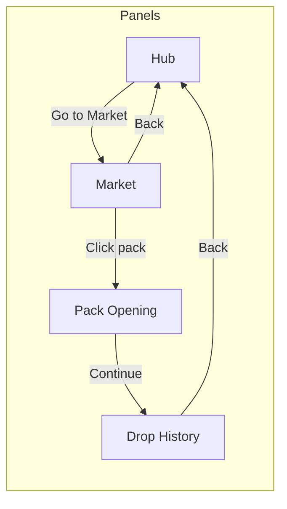
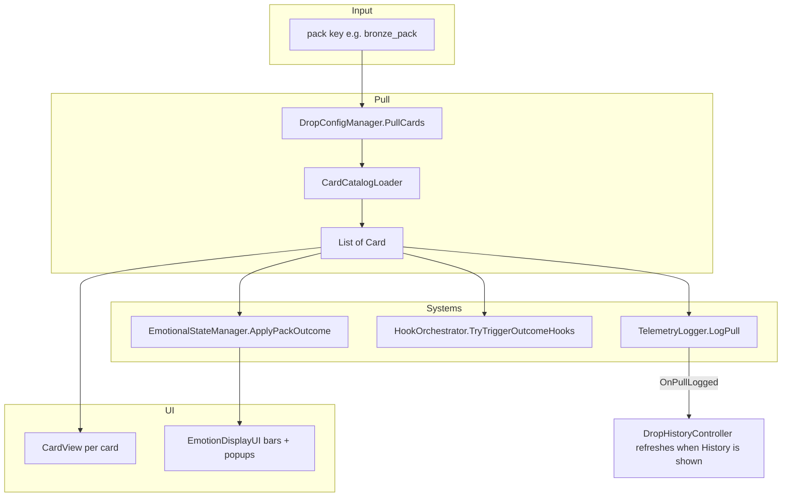
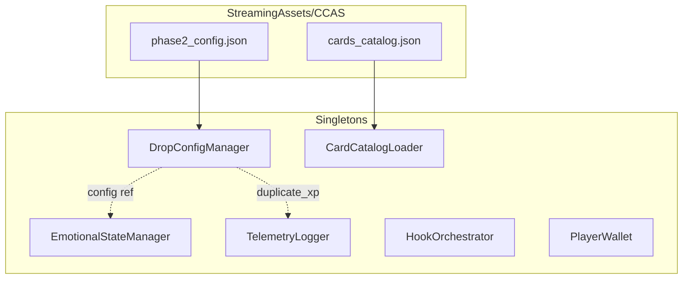
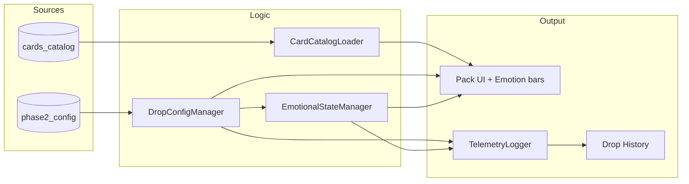

# CCAS Workflow — Flowcharts

This document uses **Mermaid** flowcharts so people can see the CCAS workflow at a glance. Mermaid renders in GitHub, GitLab, many Markdown viewers, and VS Code (with a Mermaid extension).

---

## 1. User / UI flow (navigation)

How the player moves between screens. **AcquisitionHubController** ensures only one panel is visible at a time.

- **Hub:** Coins/XP display; buttons to Market, My Packs (disabled), and (from other panels) back.
- **Market:** **BoosterMarketAuto** builds one button per pack from config; clicking a pack opens it (no purchase step yet).
- **Pack Opening:** **PackOpeningController** shows pulled cards; Continue goes to History.
- **Drop History:** **DropHistoryController** shows recent pulls and latest Positive/Negative (Phase 2); Back returns to Hub.

---

## 2. What happens when a pack is opened

When the user opens a pack (from Market or elsewhere), this is the order of operations.

| Step | What happens |
|------|----------------|
| 1 | **DropConfigManager.PullCards(packKey)** uses config drop rates to roll rarities, then **CardCatalogLoader** returns actual **Card** objects per rarity. |
| 2 | **EmotionalStateManager.ApplyPackOutcome(packKey, rarities)** updates positive/negative and buckets (Phase 2); **EmotionDisplayUI** shows bars and emotion popups (Thrill, Relief, Worth; Disappointment, Letdown, Regret). |
| 3 | **HookOrchestrator.TryTriggerOutcomeHooks(rarities)** may fire outcome hooks (e.g. logged to telemetry). |
| 4 | **TelemetryLogger.LogPull(...)** records the pull (cards, duplicates, XP, emotion snapshot), saves JSON, exports Phase 2 CSV; **DropHistoryController** refreshes when the user opens History (subscribes to `OnPullLogged`). |
| 5 | **PackOpeningController** displays each card with **CardView** (rarity color, name, team, element, position). |

---

## 3. Startup: config and data loading

What loads at game start (before the user opens a pack). Singletons use `Awake` and `DontDestroyOnLoad`.

- **DropConfigManager:** Loads **phase2_config.json** (pack types, drop rates, Phase 2 emotion tuning, duplicate_xp).
- **CardCatalogLoader:** Loads **cards_catalog.json**, indexes by tier for fast random card lookup.
- **EmotionalStateManager** reads config from DropConfigManager for emotion parameters and routing.
- **TelemetryLogger** uses config for duplicate XP values; creates/reads `pull_history.json` and CSV export folder under `Application.persistentDataPath`. **Where that is (easy to miss):** not in the repo. **macOS:** `~/Library/Application Support/DefaultCompany/MGI_Monorepo/Telemetry/pull_history.json`. **Windows:** `%USERPROFILE%\AppData\LocalLow\DefaultCompany\MGI_Monorepo\Telemetry\pull_history.json`. See **CCAS_File_Map.md** → “Where telemetry is written.”
- **HookOrchestrator** and **PlayerWallet** initialize (no file load from CCAS folder).

---

## 4. Data flow summary (simplified)

---

## How to view the flowcharts

- **GitHub / GitLab:** Open this `.md` file in the repo; Mermaid diagrams render automatically.
- **VS Code:** Install a “Mermaid” or “Markdown Preview Mermaid Support” extension and use the Markdown preview.
- **Online:** Paste the contents of a code block into [mermaid.live](https://mermaid.live) to edit or export as image.

For script details and file locations, see **CCAS_Script_Reference_Overview.md**, **CCAS_Scripts_Detailed.md**, and **CCAS_File_Map.md** in this folder. For where **pull_history.json** and telemetry CSV are written (macOS/Windows paths), see **CCAS_File_Map.md** → “Where telemetry is written.”
